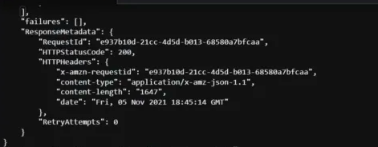
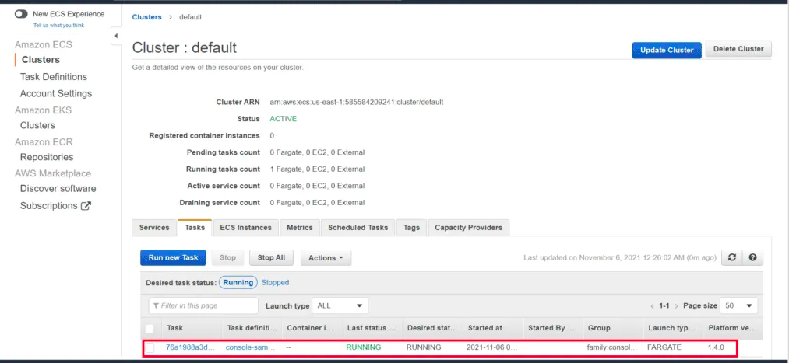
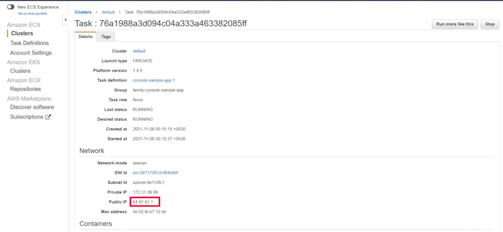
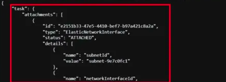

# DESCRIPTION

Here in this template, you will learn How to run and stop the ECS Task using the Boto3. 

---

#### Prerequiste

* Install Python
* AWS Configure

### Steps 

1. Open the folder in your terminal or any supported tool.
2. Run the following commands:

`python3 ecs-task-run-boto3.py`

`python3 ecs-task-stop-boto3.py`

---

### Outputs  

<b>ECS Task Run

1

2

3

ECS Task Stop</b>

---
